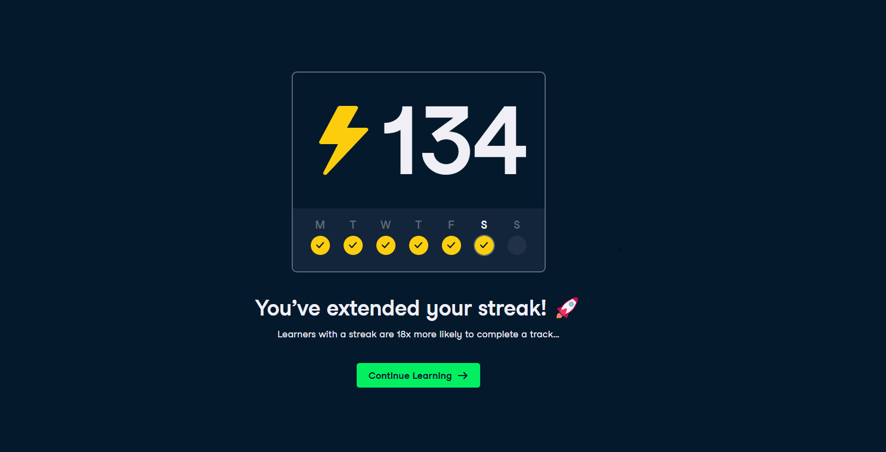

# 👋 Hi, I'm **Youssef Hassan Alghamry**  

🎓 **B.Sc. in Computer Science & Artificial Intelligence** – Benha University (GPA: 3.4/4)  
💼 **Teaching Assistant at Benha National University** | **AI Engineer at Quantum BITS**  
📚 **AI Track Trainee at ITI (9-month Program)**  
🏆 **Competitive Programmer (Codeforces & LeetCode)**  
🚀 **Specialized in AI, Deep Learning, NLP & Computer Vision**  

---

## 📬 **Contact Me**  
📧 [Email](mailto:Yousef20402@fci.bu.edu.eg)  
🔗 [LinkedIn](https://www.linkedin.com/in/youssef-hessan-alghamry/)  
⚡ [Codeforces](https://codeforces.com/profile/Youssefh)  
💡 [LeetCode](https://leetcode.com/u/MzGALELlFZ/)  
📜 [Certifications](https://drive.google.com/drive/u/0/folders/1GO2tantyMN3JJ32zkLDCk9E6m89sZajV)  

---

## 🌟 **About Me**  
I am a **passionate AI Engineer** and **Machine Learning Developer** with expertise in **Deep Learning, Natural Language Processing, and Computer Vision**.  

🔹 **Currently enrolled in ITI's 9-month AI Track**, focusing on **advanced ML, data engineering, and AI deployment**.  
🔹 **Active in competitive programming**, solving algorithmic problems on **Codeforces & LeetCode**.  
🔹 **Freelance AI Developer**, delivering AI solutions on **Mostaql & Upwork**.  
🔹 **Experienced in AI-driven healthcare applications**, integrating **AI with medical imaging**.  

📂 **Portfolio:** [🔗 View My Projects](http://65524b5355318.site123.me/)  

---

## 📈 **Progress & Achievements**  
| Platform       | Progress |
|---------------|----------|
|  | AI & Data Science Courses |
|  | Competitive Programming |
|  | Algorithmic Challenges |

---

## 📊 **GitHub Statistics**  
  
  
  

---

## 🎯 **Future Goals**  
✅ **Contribute to Open-Source AI Projects**  
✅ **Develop AI Solutions for Healthcare & Finance**  
✅ **Master Advanced Algorithms & Data Structures**  
✅ **Specialize in AI Cloud Deployments & Edge Computing**  

---
<h3 align="left">Languages and Tools:</h3>

 
    
     
     
     
     
     
     
     
     
     
     
     
     
     
     
     
     
     
     
     
     

</body>
</html>

**🚀 If you find my projects useful, don't forget to give them a ⭐!**  
